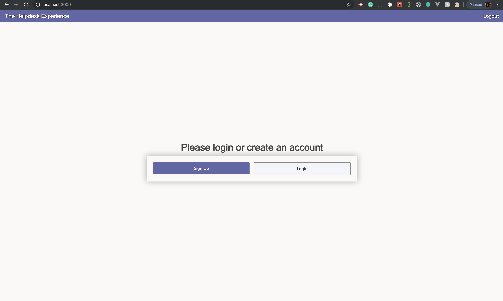
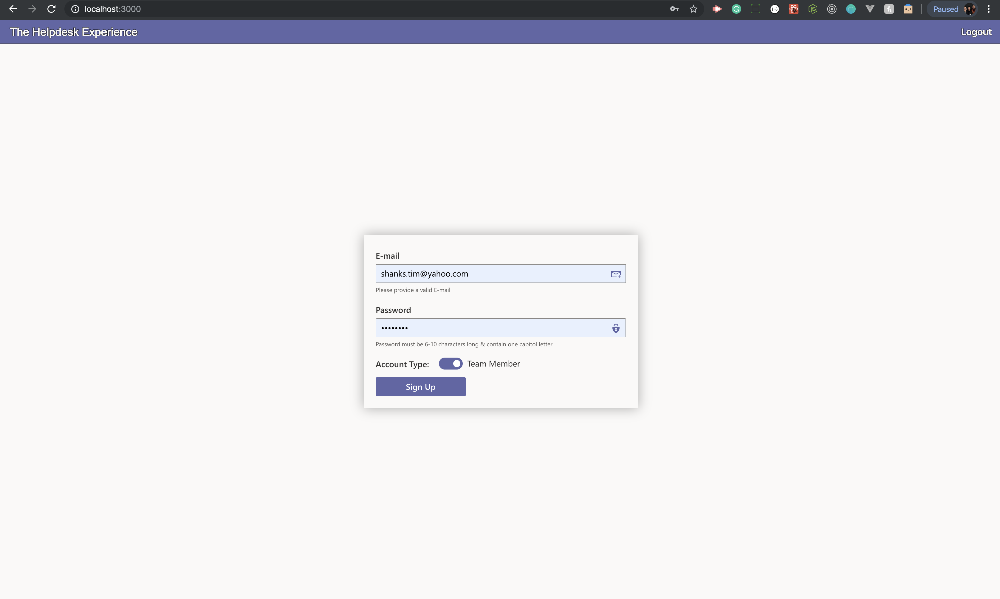
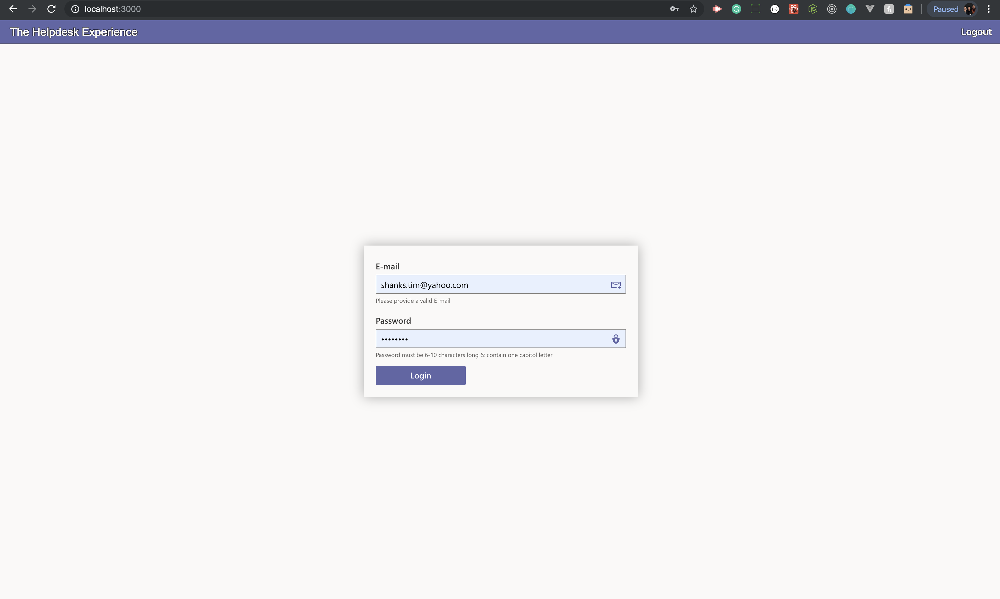
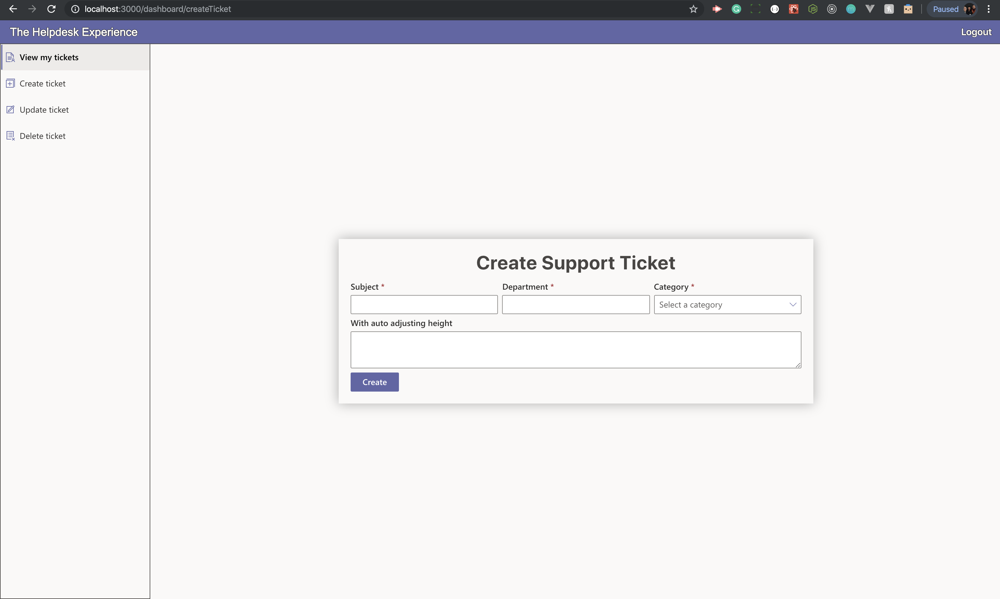
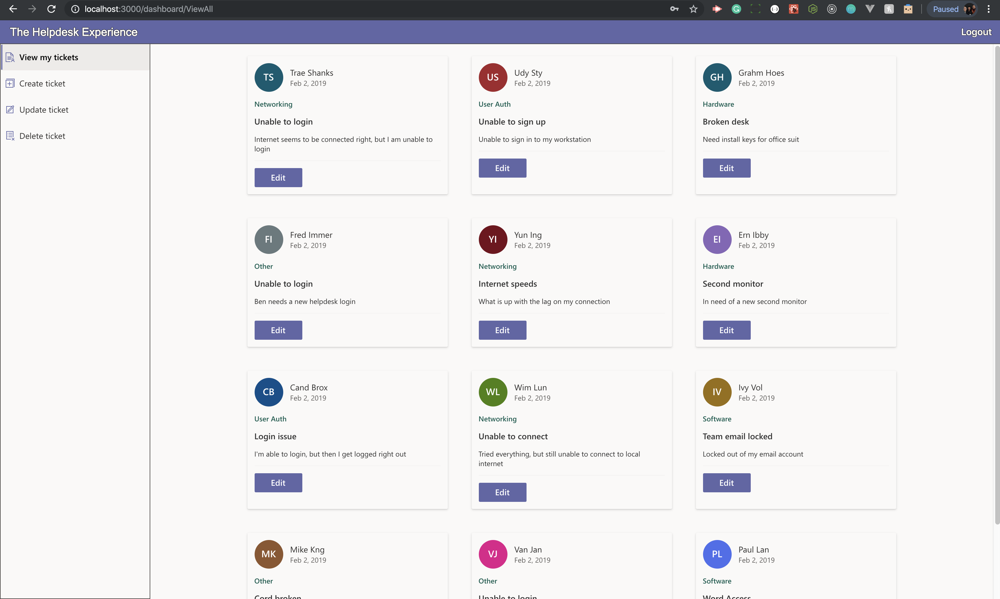
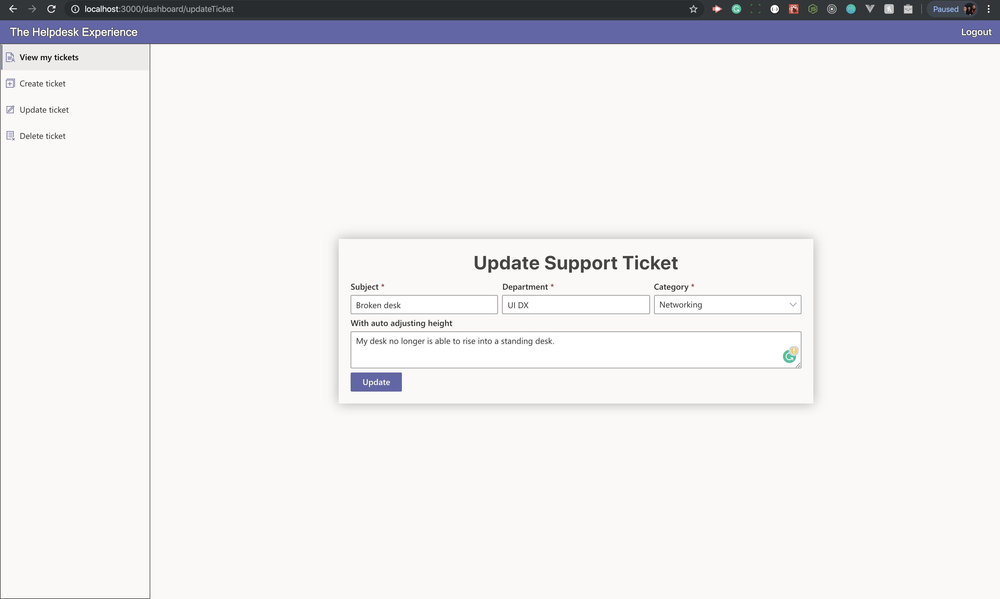
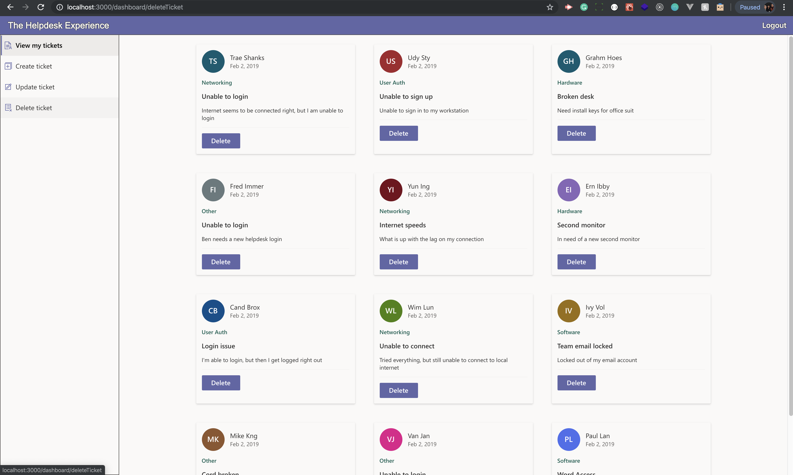

## TheHelpDeskExperience
Built a Helpdesk support ticketing web application.

## Motivation
To branch out and challenge myself to create something with technologies I've never used before. 

## Build status
This project is currently in progress, a link to the current status of this application is below:

## VIDEO WALK THROUGH OF CURRENT STATE OF APPLICATION:
https://vimeo.com/user103941507/review/366169640/56663e2a5d

## Screenshots
### Main page

### Sign up page

### Login page

### Create ticket page

### View tickets with edit option

### After edit clicked page

### Team member delete ticket view page

## Tech/framework used

<b>Used on the Front-End:</b>

- [React.js](https://reactjs.org/docs/getting-started.html)
- [React Router](https://reacttraining.com/react-router/web/guides/quick-start)
- [TypeScript](https://www.typescriptlang.org/index.html)
- [Office UI Fabric](https://developer.microsoft.com/en-us/fabric#/)
- [SCSS](https://sass-lang.com/)

<b>Used on the Back-End:</b>

- [C#](https://docs.microsoft.com/en-us/dotnet/csharp/)
- [ASP.NET](https://docs.microsoft.com/en-us/aspnet/)
- [Microsoft SQL](https://docs.microsoft.com/en-us/sql/?view=sql-server-ver15)
- [Entity Framework](https://docs.microsoft.com/en-us/ef/core/)
- [Docker](https://www.docker.com/)

### Back-End Repo: https://github.com/shankstee/helpDeskAPI

## Installation

To fully install this application you will need:

- NODE.JS/NPM
- C# .NET CORE
- MSSQL - On docker for Mac

### User Stories: 
User Story: As a User, I can log in and out of the system.
User Story: As a Helpdesk User, I can create a support ticket.
User Story: As a Helpdesk User, I can update my support tickets.
User Story: As a Helpdesk User, I can view all of my support tickets.
User Story: As a Helpdesk Team Member, I can view all support tickets.
User Story: As a Helpdesk Team Member, I can update any support ticket.
User Story: As a Helpdesk Team Member, I can delete any support ticket.

## API Routes
- Users:
https://localhost:5001/api/user - GET ALL USERS
https://localhost:5001/api/user - POST NEW USER with req.body
https://localhost:5001/api/user/`userId` - PUT/UPDATE A USER
https://localhost:5001/api/user/`userId` - DELETE A USER

- Tickets:
https://localhost:5001/api/user - GET ALL TICKETS
https://localhost:5001/api/ticket - POST NEW TICKET with req.body
https://localhost:5001/api/ticket/`ticketId` - PUT/UPDATE A TICKET
https://localhost:5001/api/ticket/`ticketId` - DELETE A TICKETS

#### This application is still in progress and this readme is here to demonstrate the current state of this application. Please see video above for walk through.
